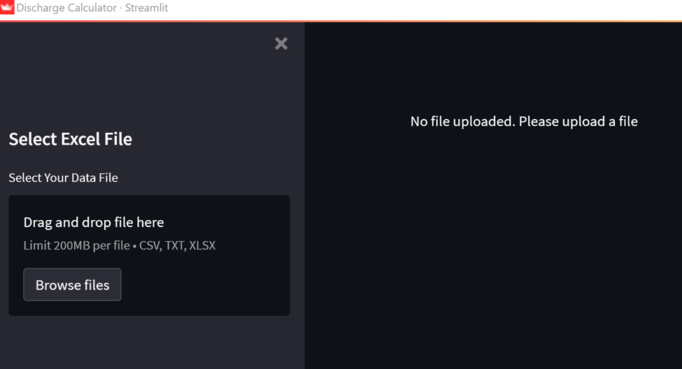
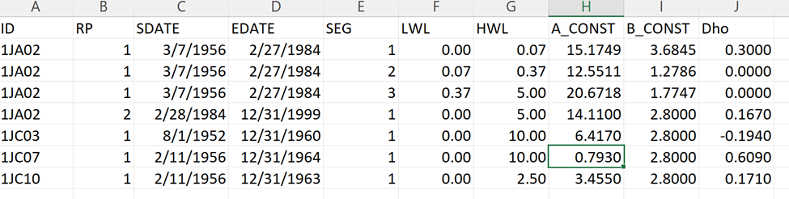
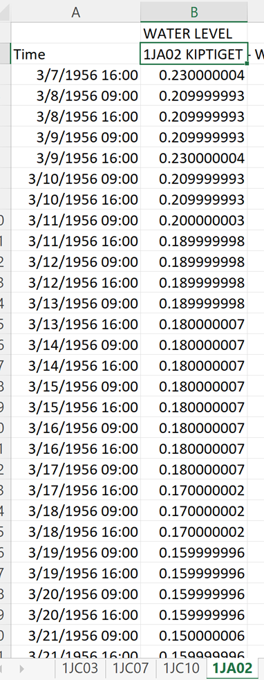

1. Clone the repository on to your local machine.
2. Create a Virtual Environment (venv) for your project.
3. Install the dependencies in the requirements.txt using pip.
4. Open the terminal and run the following command:
 
    $ cd <discharge_calculator>
 
    $ source <venv>/bin/activate
 
    $ streamlit run app.py
5. Enter URL: http://localhost:8501/
6. Upload an Excel file to the app to calculate discharge from gauge heights.

7. Click on Download File to download your calculated discharge.

## Excel Format
The input excel should have the following characteristics:
1. The Excel file should have a mandatory sheet with the rating curves called Rating Curves whose format is shown below:

2. The excel should also have other sheets whose name is one of the names in the Rating Curves sheet. The first row of the sheets should be empty or as in the example given has a Name like Water Levels. The second row should have the column names that indicate the time a measurement was taken, and the water level as shown below:

